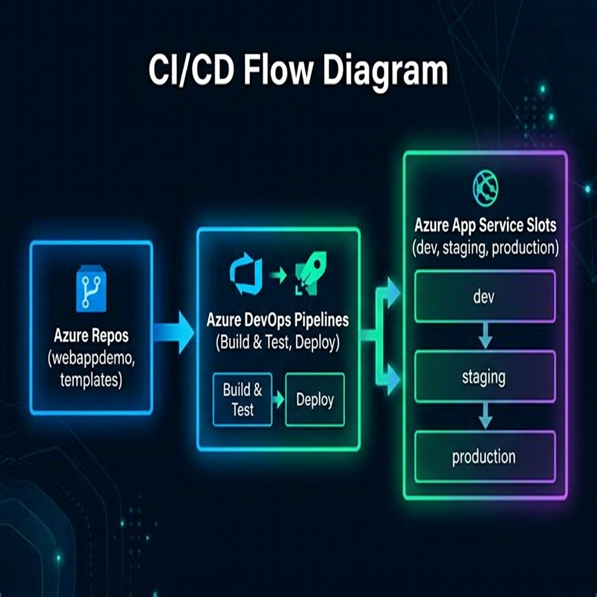

# Azure DevOps Enterprise CI/CD & Pipeline Templates Demo

This repository showcases enterprise-grade CI/CD patterns in Azure DevOps (ADO) for a Node.js Express application, demonstrating **Monolithic Pipelines**, **Centralized Shared Templates**, and **Advanced Parameter Controls** with Zero-Downtime Slot Swapping.

---

## 🏗️ Architecture Diagram

Below is the visual overview of the multi-repository pipeline architecture and deployment flow:



```mermaid
graph TD
    %% Repositories Node Group
    subgraph ADO_Repos [Azure Repos]
        AppRepo[webappdemo Repo<br>Source Code + Root YAML]
        TemplateRepo[templates Repo<br>Central Shared Templates]
    end

    %% Pipeline Execution Group
    subgraph ADO_Pipelines [Azure DevOps Pipelines]
        Trigger{Code Commit /<br>Manual Run} --> Checkout[Checkout app code &<br>fetch templates]
        Checkout --> StageBuild[Stage: Build & Test]
        
        subgraph BuildSteps [Build Steps]
            StageBuild --> NodeSetup[Install Node.js]
            NodeSetup --> NPMInstall[Install Dependencies<br>npm ci]
            NPMInstall --> RunTests[Run Unit Tests<br>npm test]
            RunTests --> CopyStaging[Copy node_modules + code<br>to staging]
            CopyStaging --> Archive[Archive zip package]
            Archive --> Publish[Publish Drop Artifact]
        end

        Publish --> StageDeploy[Stage: Deploy]

        subgraph DeploySteps [Deploy Steps]
            StageDeploy --> Download[Download Drop Artifact]
            Download --> EnvCheck{Target Env?}
            
            %% Dev/Staging Flow
            EnvCheck -- Dev / Staging -- SlotEnsure{Create Slot if<br>Not Exists?}
            SlotEnsure -->|az webapp slot create| SlotDeploy[Deploy package to<br>target slot]
            
            %% Production Flow
            EnvCheck -- Production --> SecAudit[Optional Task:<br>🔒 Security Audit]
            SecAudit --> WebAppDeploy[Deploy package to<br>staging slot]
            WebAppDeploy --> SlotSwap[Zero-Downtime Swap<br>staging ➔ production]
        end
    end

    %% Azure Infrastructure
    subgraph Azure_Cloud [Azure Web App Service]
        SlotDeploy --> AzureAppDevStg[Azure App Service Slots<br>demowebapp1-dev / staging]
        SlotSwap --> AzureAppProd[Azure App Service Slot<br>demowebapp1-production]
    end

    %% Styles
    classDef repo fill:#1f2937,stroke:#3b82f6,stroke-width:2px,color:#fff;
    classDef step fill:#111827,stroke:#10b981,stroke-width:1px,color:#fff;
    classDef cond fill:#7c3aed,stroke:#7c3aed,stroke-width:2px,color:#fff;
    classDef cloud fill:#0369a1,stroke:#0284c7,stroke-width:2px,color:#fff;
    
    class AppRepo,TemplateRepo repo;
    class NodeSetup,NPMInstall,RunTests,CopyStaging,Archive,Publish,Download,SlotDeploy,WebAppDeploy,SecAudit,SlotEnsure step;
    class Trigger,EnvCheck cond;
    class AzureAppDevStg,AzureAppProd,SlotSwap cloud;
```

---

## 📂 Repository Layouts

### 1. Application Repo (`webappdemo`)
Hosts source code and root pipeline orchestrator files:
```text
webappdemo/
├── server.js                          # Express App code (Modern UI)
├── package.json                       # Scripts (start/test)
├── README.md                          # This documentation file
└── .azure-pipelines/                  # Pipeline configurations
    ├── azure-pipeline-monolithic.yml   # Step 1 Demo: No Templates
    └── azure-pipeline.yml             # Step 2 Demo: With Shared Templates (Active)
```

### 2. Governance Repo (`templates`)
Hosts shared reusable templates:
```text
templates/
└── nodejs/
    ├── build-template.yml             # Reusable build template
    ├── deploy-template.yml            # Standard deploy template
    └── advanced-deploy-template.yml    # Advanced parameter-driven template
```

## 🎬 How to Run the Demos

### 1️⃣ Step 1: Monolithic Pipeline (No Templates)
- **Path**: `.azure-pipelines/azure-pipeline-monolithic.yml`
- **Concept**: Shows a self-contained inline pipeline. Explain the pain points of duplicating this code across dozens of microservices.

### 2️⃣ Step 2: Centralized & Advanced Templated Pipeline
- **Path**: `.azure-pipelines/azure-pipeline.yml`
- **Concept**: Shows a pipeline consuming shared templates from the `templates` repo. Includes **runtime UI parameters** (for choosing Dev/Staging/Prod, triggering security scans, and toggling deployment slot creation).

